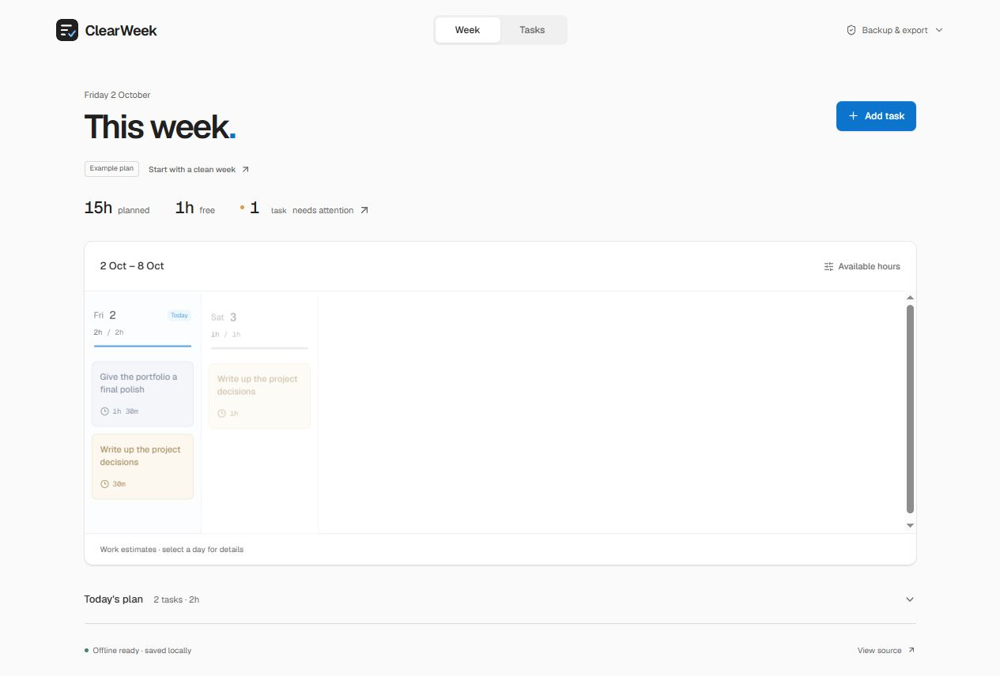

# ClearWeek

[](https://github.com/nm2064/clearweek/actions/workflows/check.yml)

**Your tasks, deadlines, and available time in one place.**

ClearWeek is a small, private planner for students, side projects, and busy weeks. Add a deadline, estimate the work, and choose how much time you have each day. It makes a suggested plan and shows where you need more room.

[Try ClearWeek](https://nm2064.github.io/clearweek/) · [How the plan works](docs/how-it-works.md)



[View the phone layout](docs/mobile.png) · [View the task list](docs/tasks.png)

## What you can do

- Add, edit, search, and complete tasks across different projects.
- Set your available hours for each day of the week.
- See a suggested daily plan, with earlier deadlines first.
- Switch between a seven-day board and a separate task list.
- Open daily details when you need them, and filter tasks by project area.
- Spot overdue work and tasks that need more time.
- Log progress and undo your last change.
- Save and restore a backup, or export deadlines to a calendar.
- Keep using the app offline after the first visit has finished loading.

The first visit includes a clearly labelled example week. Choose **Start with a clean week** to use your own tasks.

## Run it locally

You need [Node.js](https://nodejs.org/) 22 or newer. There are no packages to install.

```sh
git clone https://github.com/nm2064/clearweek.git
cd clearweek
node --run start
```

Open **http://127.0.0.1:4173**. Keep that command running while you use the local app. Opening the HTML file directly will not load the app correctly.

```sh
node --run check
```

This checks the main scripts and runs 18 tests covering deadlines, available time, progress, dates, backups, and calendar files. GitHub also runs the checks with Node.js 22 and 24.

## Your data

Tasks stay in this browser on this device. ClearWeek has no account, tracking, or server that receives your tasks. GitHub serves the website files, so normal hosting requests still occur.

Use **Backup & export → Save backup** before changing browsers or clearing browsing data. A backup includes your task names, projects, and deadlines; keep it somewhere appropriate. Restoring a backup replaces the current plan, with Undo available for the last change.

The local app and the live demo have separate saved plans. Private browsing or browser storage limits may prevent saving; the app shows a warning if a save fails.

Calendar export creates all-day deadline events for unfinished tasks. It does not book your suggested work sessions. Repeated imports may create duplicates, depending on your calendar app.

## A realistic starting point

The plan uses your estimates and a repeating weekly time budget. It can split work across days, but it cannot account for meetings, dependencies, energy levels, or unexpected interruptions. Overdue tasks remain flagged even when there is time to work on them today. Later tasks that cannot fit yet are labelled **Plan later**.

Browser checks cover adding and editing tasks, progress, completion, Undo, search, changing hours, downloading and restoring backups, calendar export, a 375-pixel phone layout, and reloading with the local server stopped. This is not a full accessibility audit.

## Built with

Plain JavaScript, HTML, and CSS. The planning logic is separate from the screen, so it can be tested without a browser. The app uses browser storage and a service worker for offline access. There is no build step or outside runtime dependency.

The interface uses locally bundled Lucide icons, Geist fonts, and Radix colour scales. Their sources and licenses are listed in [UI credits](THIRD_PARTY.md). The week board scrolls horizontally on smaller screens; the rest of the page fits the screen.

The quieter layout and motion follow selected guides from [MengTo Skills](https://github.com/MengTo/Skills) and [Emil Kowalski's skills](https://github.com/emilkowalski/skills). Tabs slide, forms fade into place, and the board has a short first entrance. Keyboard actions stay immediate. The app respects your device's reduced-motion setting and uses browser features rather than an animation package.

Created by [Noman Maqsudi](https://github.com/nm2064). Released under the [MIT license](LICENSE).
